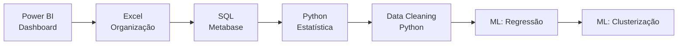

# 📊 Desafios Escola DNC - Ciência de Dados

<div align="center">


**Minha jornada em Data Analytics & Business Intelligence**

</div>

## 📋 Sobre o Repositório

Este repositório documenta minha evolução na análise de dados através dos desafios práticos realizados na **Escola DNC**. Cada projeto representa uma habilidade específica no universo de BI e Data Science.

## 🛠 Stack Tecnológica

<div align="center">

| Business Intelligence | Análise de Dados | Ferramentas |
|----------------------|------------------|-------------|
|  |  |  |
|  |  |  |
|  |  |  |

</div>

## 📁 Estrutura dos Desafios

```
desafios-dnc/
├── 📊 desafio-01-dashboard-ecommerce/
│   └── 📄 dashboard_ecommerce.pbix
├── 📈 desafio-02-dashboard-marketing/
│   └── 📄 dashboard_marketing.pbix
├── 📋 desafio-03-planilha-excel/
│   └── 📄 planilha_informatica.xlsx
├── 🗃️ desafio-04-analises-sql/
│   └── 📊 apresentacao_metabase.pptx
├── 🔬 desafio-05-analise-estatistica/
│   └── 📓 analise_estatistica.ipynb
├── 🧹 desafio-06-limpeza-airbnb/
│   └── 📓 limpeza_dados_airbnb.ipynb
├── 📉 desafio-07-modelos-regressao/
│   └── 📓 modelos_regressao.ipynb
└── 🎯 desafio-08-modelos-clusterizacao/
    └── 📓 modelos_clusterizacao.ipynb
```

## 🚀 Desafios Realizados

### 📊 **Desafio 01 - Dashboard de E-commerce no Power BI**
- **Arquivo:** `dashboard_ecommerce.pbix`
- **Ferramenta:** Power BI
- **Tipo:** Business Intelligence
- **Status:** ✅ Concluído

> 📝 **MINHA DESCRIÇÃO DO DESAFIO:**
> *Desafio em que tive que criar 2 dashboards para um E-commerce fictício, um de vendas e um de clientes. Usei IA para a criação da identidade visual dos dashboards.
> 
> O Dashboard de Vendas contém informaçãoes de: Canal de Venda, Faturamento, Histórico e Quantidade de Vendas, e os seguintes filtros: Bandeira, Estado, Departamento e Canal de Venda.
> 
> O Dashboard de Clientes contém informações sobre: a Quantidade de Clientes, a Renda dos Clientes e a Faixa Etária dos Clientes, contendo filtros de: Renda, Faixa Etária e Estado.
> 
> A partir deste Dashboard é possível tirar Insights sobre qual canal de venda é o melhor a ser utilizado, qual nicho de clientes tende a comprar neste e-commerce, dentre outros valiosos para o entendimento do negócio.*

---

### 📈 **Desafio 02 - Dashboard para empresa de marketing digital no Power BI**
- **Arquivo:** `dashboard_marketing.pbix`
- **Ferramenta:** Power BI
- **Tipo:** Business Intelligence
- **Status:** ✅ Concluído

> 📝 **MINHA DESCRIÇÃO DO DESAFIO:**
> *Para este desafio tive que criar 2 dashboards, um com uma visão geral e outro com uma visão detalhada, e neste desafio também criei a identidade visual dos dashboards utilizando IA.
> 
> Para a Visão Geral foram utilizadas várias métricas como a Soma do Total de Visualizações, a Receita Total, Receita Média por Compra dentre outras, além dos filtros de Data, Origem, Gênero e Plataforma.
>
> Para a Visão Detalhada foram apresentadas as Origens dos Compradores e o quantitativo de compradores e visualizações por dia.
>
>  Também tomei a liberdade de fazer uma Visão Geral alternativa trocando o gráfico de barras 'Usuários X Cidade' por um gráfico de mapa.
>
> Através destes dashboards a empresa conseguiria tirar insights sobre qual plataforma trá mais retorno, onde estão localizados seus usuários, as origens de seus compraodres, dentre outros*

---


## 📈 Minha Jornada de Aprendizado



## 🏆 Habilidades Desenvolvidas

- ✅ **Business Intelligence:** Criação de dashboards interativos
- ✅ **Análise Exploratória:** Estatística descritiva e visualização
- ✅ **SQL:** Consultas complexas e análise de dados
- ✅ **Data Cleaning:** Preparação e tratamento de datasets
- ✅ **Machine Learning:** Modelos supervisionados e não-supervisionados
- ✅ **Storytelling com Dados:** Apresentação de insights

## 🚀 Como Executar os Projetos

### Power BI (.pbix)
1. Abra o arquivo no Power BI Desktop
2. Configure as conexões de dados se necessário
3. Interaja com os visuais e filtros

### Excel (.xlsx)
- Abra no Microsoft Excel ou Google Sheets

## 📫 Contato

<div align="center">

**Desenvolvido por André Valenga**

[]([https://linkedin.com/in/seu-linkedin](https://www.linkedin.com/in/andr%C3%A9-felipe-pais-valenga-5a53ab154/))
[](mailto:andrevalengadata@gmail.com)

---

*"Transformando dados em insights decisivos"*

</div>
