# 📊 Desafios Escola DNC - Ciência de Dados

<div align="center">


**Minha jornada em Data Analytics & Business Intelligence**

</div>

## 📋 Sobre o Repositório

Este repositório documenta minha evolução na análise de dados através dos desafios práticos realizados na **Escola DNC**. Cada projeto representa uma habilidade específica no universo de BI e Data Science.

## 🛠 Stack Tecnológica

<div align="center">

| Business Intelligence | Análise de Dados | Ferramentas |
|----------------------|------------------|-------------|
|  |  |  |
|  |  |  |
|  |  |  |

</div>

## 📁 Estrutura dos Desafios

```
desafios-dnc/
├── 📊 desafio-01-dashboard-ecommerce/
│   └── 📄 dashboard_ecommerce.pbix
├── 📈 desafio-02-dashboard-marketing/
│   └── 📄 dashboard_marketing.pbix
├── 📋 desafio-03-planilha-excel/
│   └── 📄 planilha_informatica.xlsx
├── 🗃️ desafio-04-analises-sql/
│   └── 📊 apresentacao_metabase.pptx
├── 🔬 desafio-05-analise-estatistica/
│   └── 📓 analise_estatistica.ipynb
├── 🧹 desafio-06-limpeza-airbnb/
│   └── 📓 limpeza_dados_airbnb.ipynb
├── 📉 desafio-07-modelos-regressao/
│   └── 📓 modelos_regressao.ipynb
└── 🎯 desafio-08-modelos-clusterizacao/
    └── 📓 modelos_clusterizacao.ipynb
```

## 🚀 Desafios Realizados

### 📊 **Desafio 01 - Dashboard de E-commerce no Power BI**
- **Arquivo:** `dashboard_ecommerce.pbix`
- **Ferramenta:** Power BI
- **Tipo:** Business Intelligence
- **Status:** ✅ Concluído

> 📝 **MINHA DESCRIÇÃO DO DESAFIO:**
> *Desafio em que tive que criar 2 Dashboards para um E-commerce fictício, um de vendas e um de clientes.*

---


## 📈 Minha Jornada de Aprendizado

```mermaid
graph LR
    A[Power BI<br>Dashboard] --> B[Excel<br>Organização]
    B --> C[SQL<br>Metabase]
    C --> D[Python<br>Estatística]
    D --> E[Data Cleaning<br>Python]
    E --> F[ML: Regressão]
    F --> G[ML: Clusterização]
```



## 🏆 Habilidades Desenvolvidas

- ✅ **Business Intelligence:** Criação de dashboards interativos
- ✅ **Análise Exploratória:** Estatística descritiva e visualização
- ✅ **SQL:** Consultas complexas e análise de dados
- ✅ **Data Cleaning:** Preparação e tratamento de datasets
- ✅ **Machine Learning:** Modelos supervisionados e não-supervisionados
- ✅ **Storytelling com Dados:** Apresentação de insights

## 🚀 Como Executar os Projetos

### Power BI (.pbix)
1. Abra o arquivo no Power BI Desktop
2. Configure as conexões de dados se necessário
3. Interaja com os visuais e filtros

### Jupyter Notebooks (.ipynb)
```bash
# Instale as dependências
pip install pandas numpy matplotlib seaborn scikit-learn jupyter

# Execute o Jupyter
jupyter notebook
```

### Excel (.xlsx)
- Abra no Microsoft Excel ou Google Sheets

## 📫 Contato

<div align="center">

**Desenvolvido com 💙 por [Seu Nome]**

[](https://linkedin.com/in/seu-linkedin)
[](mailto:seu-email@gmail.com)

---

*"Transformando dados em insights decisivos"*

</div>
